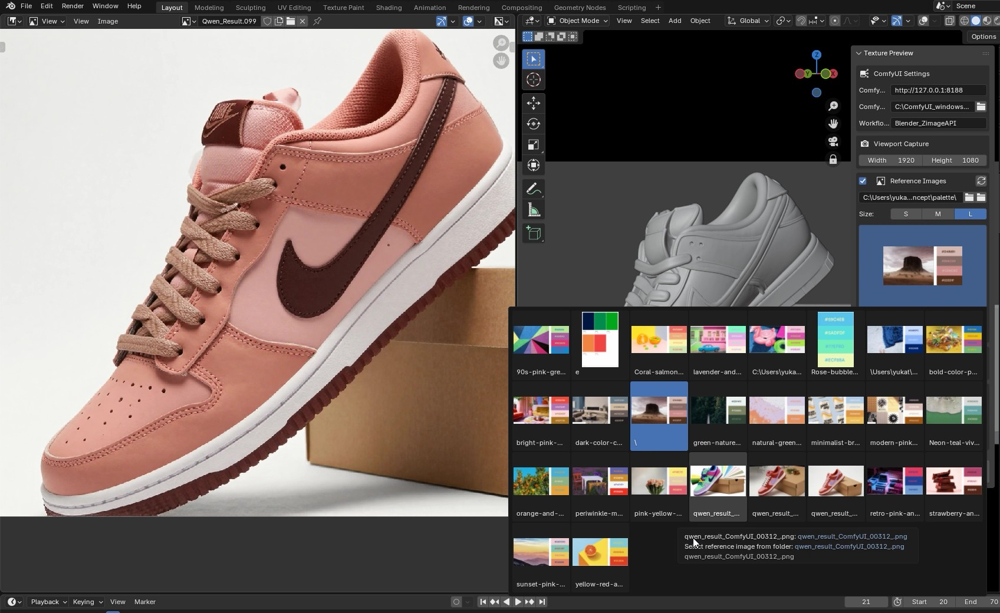
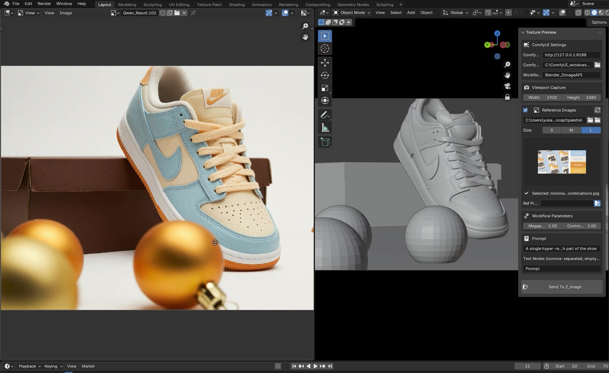
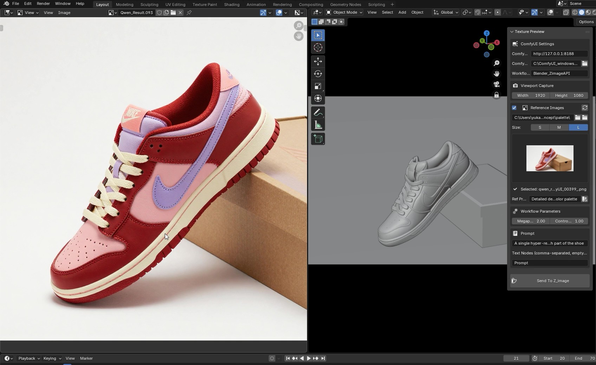
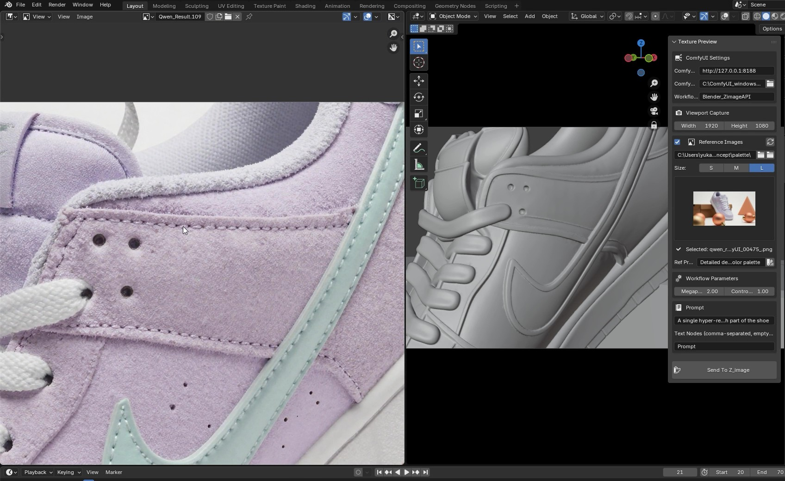

# Blender-ComfyUI Texture Bridge (Experimental)

  

An experimental addon developed under the **Antigravity** project. This tool connects Blender directly to a local **ComfyUI** instance in the background, enabling a native "Texture Preview" workflow within the viewport.

## ⚠️ State of Development
**This project is currently a Work In Progress (WIP).**
It is a spare-time experiment. While functional, you may encounter:
* Inconsistencies in generation.
* Bugs and stability issues.
* Unoptimized performance.

## ✨ Key Features
* **Native Integration:** Connects to ComfyUI via API directly from the Blender sidebar.
* **Advanced AI Stack:** Utilizes **Zimage** combined with **ControlNet** to understand geometry.
* **Consistency:** Designed to generate texture previews that maintain consistency across different camera angles.
* **Palette Control:** Includes a color palette system to force specific color schemes onto the generated textures.

## 📸 Gallery
Here is a look at the current UI and results on a test model (Nike Dunk Low) using different color palettes and camera angles.

### Interface & Color Palettes
The addon allows selecting reference images and palettes directly in the side panel.

### Multi-Angle & Color Consistency
Testing different colorways and angles to ensure the ControlNet maintains the shoe's structure.
| Variation 1 | Variation 2 |
| :---: | :---: |
|  |  |

### Detail Retention
Close-up test to verify texture quality and seam handling.

## 🛠️ Requirements (Planned)
* Blender 4.x
* Local installation of ComfyUI
* Required ComfyUI Custom Nodes (Zimage, ControlNet preprocessors)

## 📄 License
This project is licensed under the **GNU GPL v3**.
